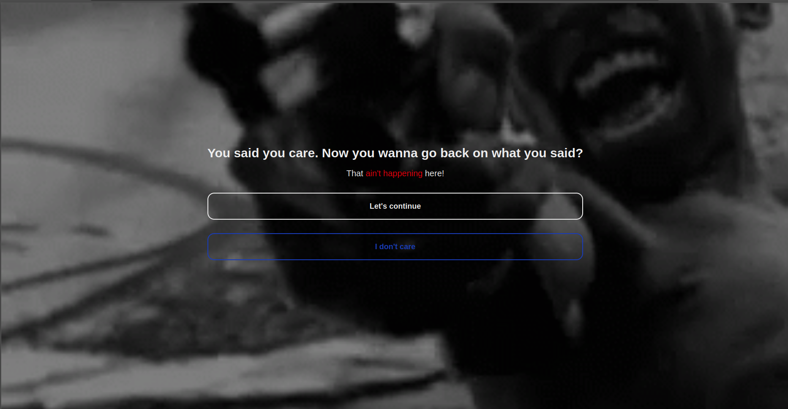

# Mind Me 🎯


## A website that calls for your attention
### Team Name: Nakama


### Team Members
- Team Lead: Falah - SOE Cusat
- Member 2: Bantupalli Prudvi John - SOE Cusat

### Project Description
The site asks some questions and gives response based on that. Sometimes fun, sometimes helpful :)

### The Problem (that doesn't exist)
We are getting bored. Well, we were!

### The Solution (that nobody asked for)
A preset website (I hoped for a larger dataset :\( ) to roast us. Ah well, maybe to motivate us

## Technical Details
### Technologies/Components Used
For Software:
- Typescript
- Nextjs

For Hardware:
- My Laptop 

### Implementation
For Software:
# Installation
```pnpm i```

# Run
```pnpm dev```

### Project Documentation
For Software:

# Screenshots (Add at least 3)

*When you say you want to go back*


*How title changes when tabs are switched*


*An exaple of question asked by the site*


For Hardware:

# My lap
That's all I used. 

### Project Demo

# Additional Demos
 [Check it here](mind-me.vercel.app)

---
Made with ❤️ at TinkerHub Useless Projects 


